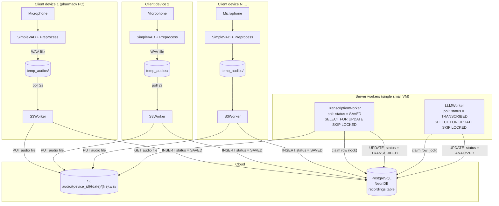
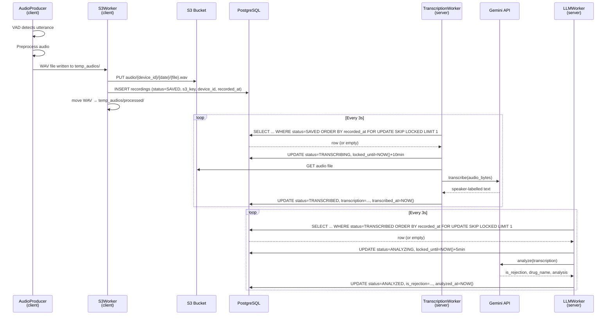
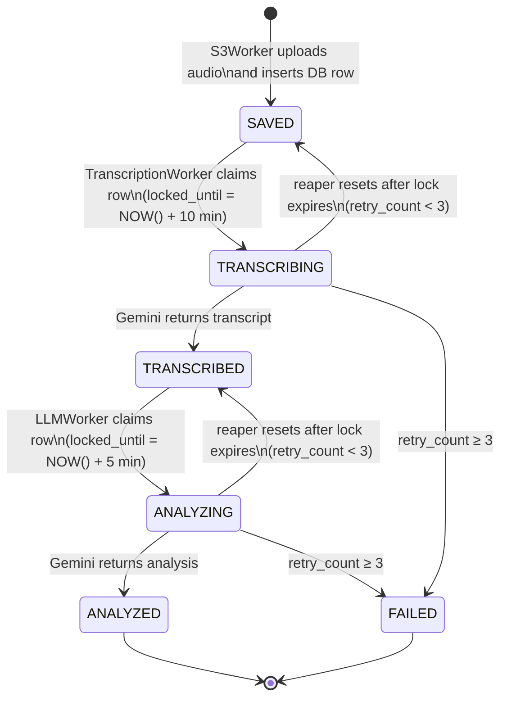
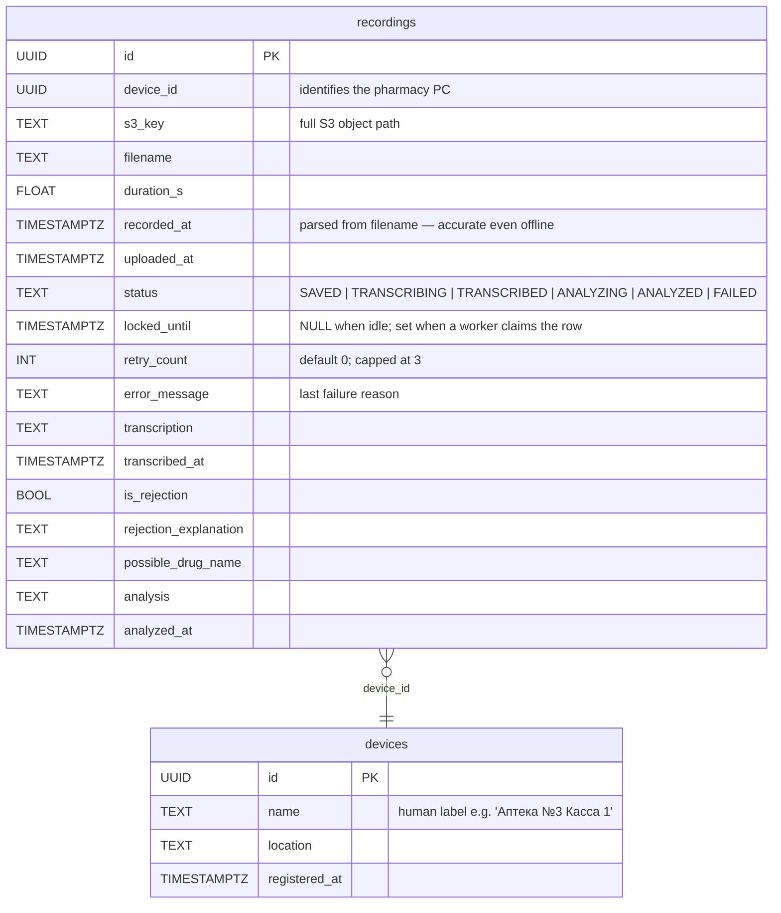

# AlphaMed — Production Architecture

## Design Goals

| Goal | Decision |
|---|---|
| Cheap | No Kafka/RabbitMQ — PostgreSQL is the queue |
| Simple | Status column drives the entire pipeline |
| Fault tolerant | Idempotent ops everywhere, locked_until reaper, local buffer |
| Consistent | Single source of truth: one DB, atomic status transitions |
| Multi-device | N client devices, 2 shared server workers |

---

## System Overview



---

## Pipeline — Step by Step



---

## Status State Machine



---

## Database Schema



> One table for all recordings keeps queries simple. Add a `devices` lookup table for labelling each pharmacy PC.

---

## Queue Mechanism — Why PostgreSQL, Not Kafka/RabbitMQ

| Option | Cost | Complexity | Ordering | Verdict |
|---|---|---|---|---|
| **PostgreSQL SKIP LOCKED** | $0 (already paying) | None — it's just SQL | Per-device `ORDER BY recorded_at` | ✅ Chosen |
| RabbitMQ (CloudAMQP) | Free tier: 1M msg/mo | New service to operate | Per-queue FIFO | Overkill |
| Kafka (Confluent Cloud) | $0 free tier, then $~150/mo (MSK) | High | Per-partition | Very overkill |
| AWS SQS FIFO | $0.50/M msgs | New service | 300 msg/s per group | Reasonable alternative |

**The key query** (both workers use the same pattern, different `status` value):

```sql
BEGIN;

SELECT id, s3_key, device_id, recorded_at
FROM   recordings
WHERE  status = 'SAVED'
  AND  (locked_until IS NULL OR locked_until < NOW())
ORDER  BY recorded_at ASC
LIMIT  1
FOR UPDATE SKIP LOCKED;

-- if a row is returned:
UPDATE recordings
SET    status       = 'TRANSCRIBING',
       locked_until = NOW() + INTERVAL '10 minutes',
       status_updated_at = NOW()
WHERE  id = :claimed_id;

COMMIT;
```

`SKIP LOCKED` means multiple workers never block each other — each one atomically grabs the next available row. If worker 1 crashes holding a lock, `locked_until` expires and the reaper resets the row.

---

## Fault Tolerance

### Client-side

| Failure | Recovery |
|---|---|
| S3 upload fails | File stays in `temp_audios/`. S3Worker retries on next 2s poll cycle. |
| DB insert fails | S3Worker retries. S3 key is deterministic (`device_id/date/filename`) so the PUT is idempotent — re-uploading the same file is safe. |
| Process crash | On restart, S3Worker rescans `temp_audios/` and picks up all unprocessed files. |
| DB unreachable | S3Worker buffers locally. Audio never lost — it stays on disk until the DB is reachable. |

### Server-side (reaper — runs every 60s)

```sql
-- Reset stuck TRANSCRIBING jobs
UPDATE recordings
SET    status       = 'SAVED',
       retry_count  = retry_count + 1,
       locked_until = NULL
WHERE  status       = 'TRANSCRIBING'
  AND  locked_until < NOW()
  AND  retry_count  < 3;

-- Same for ANALYZING
UPDATE recordings
SET    status       = 'TRANSCRIBED',
       retry_count  = retry_count + 1,
       locked_until = NULL
WHERE  status       = 'ANALYZING'
  AND  locked_until < NOW()
  AND  retry_count  < 3;

-- Permanently fail after 3 retries
UPDATE recordings
SET    status = 'FAILED'
WHERE  status IN ('TRANSCRIBING', 'ANALYZING')
  AND  locked_until < NOW()
  AND  retry_count  >= 3;
```

The reaper runs inside either worker process — no separate service needed.

---

## S3 Layout

```
alphamed-audio/
└── {device_id}/
    └── {YYYY}/{MM}/{DD}/
        └── {unix_timestamp}_{uuid6}.wav
```

Example: `alphamed-audio/a1b2c3d4.../2026/06/05/1778502599_ebb57e.wav`

- **No ACLs needed** — server workers use an IAM role; client devices use a scoped IAM user with `PutObject` only on their own prefix (`audio/{device_id}/*`)
- **Lifecycle rule**: move to S3 Glacier after 90 days → ~$0.004/GB/mo vs $0.023/GB/mo standard

---

## Component Specs

### Client: AudioProducer
_Unchanged from MVP1_ — MicrophoneClient + SimpleVAD + preprocessing pipeline. Writes `temp_audios/{timestamp}_{uuid6}.wav`.

### Client: S3Worker
```
watch_dir:     temp_audios/
poll_interval: 2s
on_file_found:
  1. boto3.client.put_object(Bucket, Key=s3_key, Body=wav_bytes)
  2. db.execute(INSERT INTO recordings ...)
  3. shutil.move(file, temp_audios/processed/)
```
Uses `boto3`. One retry with exponential backoff per step before leaving the file for the next cycle.

### Server: TranscriptionWorker
```
poll_interval: 3s
on_row_claimed:
  1. s3.get_object → audio_bytes
  2. _transcribe_sync(audio_bytes)   ← reuse MVP1 Gemini path
  3. UPDATE status=TRANSCRIBED, transcription=..., transcribed_at=NOW()
on_failure:
  UPDATE error_message=..., release lock (reaper handles retry)
```

### Server: LLMWorker
```
poll_interval: 3s
on_row_claimed:
  1. fetch transcription from DB (no S3 needed)
  2. RejectionAnalyzer.analyze(transcription)
  3. UPDATE status=ANALYZED, is_rejection=..., analyzed_at=NOW()
```

### Server: Reaper (co-hosted inside LLMWorker process)
Runs every 60s as an `asyncio` background task. Executes the three SQL statements above.

---

## Deployment

```
Cloud VM (Fly.io shared-cpu-1x or EC2 t3.micro)
├── transcription_worker.py   (asyncio, polls every 3s)
├── llm_worker.py             (asyncio, polls every 3s + reaper every 60s)
└── both started by:  supervisord / systemd / docker-compose
```

Both workers are stateless — they only read from S3 and read/write to DB. You can run two instances of each for horizontal scaling with no code changes (SKIP LOCKED handles the coordination).

---

## Cost Estimate (medium load: ~500 recordings/day)

| Service | Usage | Cost/mo |
|---|---|---|
| S3 storage | 500 × ~150KB × 30 days ≈ 2.1 GB | ~$0.05 |
| S3 PUT requests | 15,000 | ~$0.08 |
| S3 GET requests | 15,000 | ~$0.006 |
| NeonDB (PostgreSQL) | Scale plan | $19 |
| Fly.io VM (server workers) | shared-cpu-1x, 256MB | $5 |
| Gemini API | ~500 transcriptions + 500 analyses/day | ~$10–15 |
| **Total** | | **~$35–40/mo** |

NeonDB free tier (0.5 GB compute-hours/mo) covers early development. Switch to Scale ($19) before go-live.

---

## What Was Deliberately Left Out

- **Kafka / RabbitMQ** — adds $50–150/mo and an ops burden for no gain at this scale. PostgreSQL `SKIP LOCKED` is a well-established queue pattern used by Solid Queue (Rails), Oban (Elixir), and pgqueue (Python).
- **Lambda for workers** — polling loops on Lambda are wasteful (cold starts, 15-min max duration). A persistent $5 VM is simpler and cheaper.
- **Redis** — no hot cache needed; DB read on each poll is negligible.
- **API Gateway / HTTP layer** — the workers talk directly to DB and S3. No HTTP hop between client and server; S3 + DB are the interface contract.
